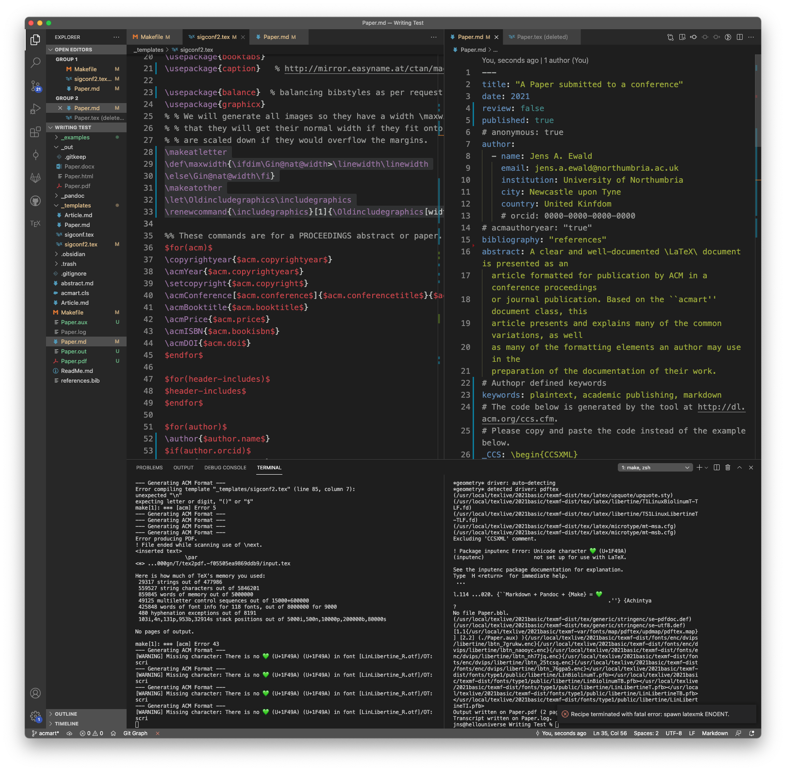

# Introduction

Ullamco pariatur nostrud commodo ullamco magna ea. Non et magna magna dolor officia do proident cillum eiusmod reprehenderit irure laborum sit mollit. Elit ipsum esse non irure proident magna fugiat reprehenderit laborum quis id pariatur velit cillum. Elit qui esse dolore sint ex aliquip proident mollit minim dolore esse qui. Deserunt mollit elit nisi dolore est ad deserunt.^[Foot notes can also be inlined.]

Eiusmod laborum ipsum pariatur veniam eu non quis exercitation minim commodo incididunt consequat. Adipisicing sunt veniam do magna. Enim elit adipisicing nulla ad Lorem ea reprehenderit ullamco proident reprehenderit eu. Id anim est aliqua ut anim ut velit et cupidatat minim incididunt in. Labore velit in enim minim consequat exercitation Lorem do sunt exercitation ad do aliquip. Elit velit Lorem veniam mollit est sint aute excepteur exercitation et. Amet quis cillum fugiat ex.[@raoMarkdownPandocMake2020] 

# Preconditions

Amet excepteur cupidatat incididunt excepteur labore deserunt exercitation eiusmod sit irure nisi voluptate. Mollit ullamco dolor dolore quis esse magna adipisicing laboris nostrud fugiat cupidatat exercitation dolore. Lorem ipsum ad exercitation incididunt nisi sint pariatur eu aliquip et laboris. Id labore veniam elit consequat consectetur sit minim nulla. Ut proident proident nulla excepteur ex ullamco. Culpa ea reprehenderit eu pariatur nisi ex. In laborum culpa ea anim labore ipsum et sunt.

Qui tempor ipsum voluptate cupidatat incididunt nisi exercitation occaecat nisi occaecat qui dolore ullamco enim. Dolor veniam cillum duis aliquip in ut deserunt enim. Reprehenderit cupidatat nostrud irure amet sint ea adipisicing labore veniam dolore Lorem reprehenderit.[@xieMarkdownDefinitiveGuide2018]

# How it looks in practice

Magna occaecat fugiat aliquip reprehenderit qui exercitation pariatur cillum tempor. Culpa quis irure laborum mollit nulla culpa sunt do dolor adipisicing id adipisicing exercitation. Mollit amet nostrud voluptate tempor cillum enim Lorem quis culpa pariatur officia non occaecat. Non amet sit adipisicing et non occaecat Lorem est ex aliqua enim pariatur dolore nisi. Velit Lorem nulla irure anim occaecat consequat enim ut ut Lorem (as show in @fig:vscode-view).

{#fig:vscode-view}

# References {-}

\balance
\bibliographystyle{ACM-Reference-Format}
\bibliography{sample-base}
